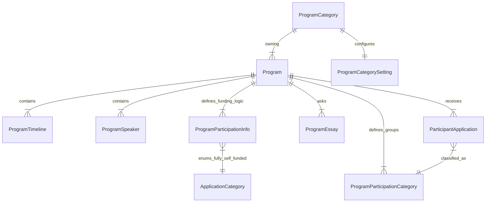

# Program Foundation Analysis

## 1. Overview
The YBB Platform's content structure is hierarchical, designed to support multiple brands (Program Categories) managing multiple events (Programs).

**Hierarchy:**
`ProgramCategory` (Brand) → `Program` (Event) → `ProgramContent` (Speakers, Schedule, etc.)

This document analyzes the database schema, dependencies, and current API implementation status to ensure a solid foundation before proceeding with complex logic like Registration.

---

## 2. Entity: ProgramCategory (Brand)
Represents an organization or brand (e.g., "YBB", "Istanbul Youth Summit"). This is the root entity for tenancy.

### 2.1 Schema & Dependencies
**Table:** `program_categories`

| Field | Description |
| :--- | :--- |
| `id` | UUID (PK) |
| `name` | Display Name |
| `slug` | URL friendly identifier (unique) |
| `settings` | 1:1 Relation to `ProgramCategorySetting` (Maintains currency, footer, analytics) |
| `socialFeeds` | 1:N Relation for Instagram/TikTok feeds |

**Dependent Tables (Downstream):**
*   `programs` (The core children)
*   `program_category_settings`
*   `program_social_feeds`
*   `system_announcements`
*   `sponsors`
*   `email_templates`
*   `legal_documents`
*   `users` (Users are scoped to a category/brand, implicitly or explicitly)

### 2.2 API Implementation Status
*   **Module:** `BrandsModule`
*   **Controller:** `BrandsController`
*   **Status:** ✅ **Complete**
    *   `GET /brands`: List all
    *   `GET /brands/:id`: Detail
    *   `POST /brands`: Create (with Logo/Banner upload)
    *   `PUT /brands/:id`: Update
    *   `DELETE /brands/:id`: Delete

---

## 3. Entity: Program (Event)
Represents a specific event instance (e.g., "IYS 2025").

### 3.1 Schema & Dependencies
**Table:** `programs`

| Field | Description |
| :--- | :--- |
| `id` | UUID (PK) |
| `programCategoryId` | FK to Parent Brand |
| `slug` | Unique per Category |
| `status` | Draft, Published, Ongoing, Completed |
| `registration` | Configuration for dates, fees, and payments |

**Dependent Tables (Content Modules):**
Almost all content is a direct child of `Program`.

1.  **Expository Content:**
    *   `program_timelines`
    *   `program_schedules`
    *   `program_speakers`
    *   `program_gallery`
    *   `program_faqs`
    *   `program_team_members`
    *   `program_partners`
    *   `program_resources`
    *   `program_testimonials`
2.  **Logic/Registration Content:**
    *   `program_participation_infos`: Defines global constraints (Fully Funded vs Self Funded settings).
    *   `program_participation_categories`: **(GAP IDENTIFIED)** Defines tracks/groups (e.g., "High School", "University").
    *   `program_essays`: Essay questions for registration.
    *   `program_requirements`: Checklist items.
    *   `program_pricing_tiers`: Payment amounts.
    *   `application_form_fields`: Custom dynamic fields.

### 3.2 API Implementation Status
*   **Module:** `ProgramsModule`
*   **Controller:** `ProgramsController`
*   **Status:** ⚠️ **Mostly Complete** (Missing one key component)
    *   ✅ **Core CRUD**: `GET`, `POST`, `PUT`, `DELETE` programs.
    *   ✅ **Content Management**: Dedicated sub-routes for `timeline`, `speakers`, `partners`, `essays`, `form-fields`, etc.
    *   ✅ **Participation Info**: Handled by `ProgramParticipationController`.
    *   ❌ **Participation Types**: **MISSING**. usage of `program_participation_categories` table has no API endpoints.

---

## 4. The Gap: ProgramParticipationCategory
The schema contains `ProgramParticipationCategory`, which is intended to classify applicants (e.g., "Student", "Professional" OR "High School", "Undergraduate").

**Current State:**
*   **Schema**: Exists (`program_participation_categories` table).
*   **Relation**: `Program` (1:N) `ProgramParticipationCategory`. `ParticipantApplication` (N:1) `ProgramParticipationCategory`.
*   **Seed Data**: Populated in `seed-dummy-content.ts` ("Future Innovators", etc.).
*   **API**: **None**. There is no way for an Admin to create or edit these categories via API.

**Why this matters:**
Registration often depends on selecting a category. If the API cannot serve these dynamic categories to the frontend, valid registration forms cannot be built dynamically.

---

## 5. Visual Architecture

## 6. Recommendations

To solidify the foundation before finalizing Registration:

1.  **Implement `ProgramParticipationCategory` endpoints**:
    *   `POST /programs/:id/participation-categories`
    *   `PUT /programs/participation-categories/:id`
    *   `DELETE /programs/participation-categories/:id`
    *   `GET /programs/:id/participation-categories` (Currently might be embedmable via `GET /programs/:id?include=participationCategories`)
2.  **Verify Frontend Consumption**:
    *   Ensure the Registration Form requests this list to populate the "Category/Track" dropdown if applicable.

This will ensure that `ParticipantApplication` records can correctly link to valid `participation_category_id` FKs.
