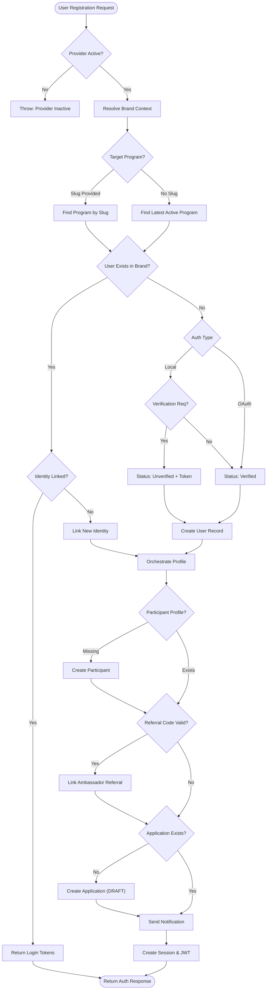

# Auth Module

The **Auth Module** manages user authentication, registration, identity management, and session handling within the YBB Platform. It is designed to support **multi-tenant branding** (via Program Categories) and **Smart Registration** flows.

## 1. Key Features

*   **Multi-Tenant/Brand Scoped**: Users are scoped to a `Brand` (Brand). A user email (`alice@example.com`) can exist separately for different brands (e.g., *YBB* vs *Istanbul Summit*).
*   **Smart Registration**:
    *   Automatically detects the target **Program** (Event) based on slugs or dates.
    *   Handles **Referral Codes** (Ambassadors) invisibly.
    *   Creates comprehensive profiles (`User` + `Participant` + `Application`) in one atomic transaction flow.
*   **Identity Linking**: Supports multiple providers (Local, Google, etc.) linked to a single user account.
*   **Session Management**: Tracks user sessions with IP, Device, and Geo-location info.
*   **Security**: Uses JWT (Access + Refresh tokens) and standard bcrypt hashing.

---

## 2. Authentication Context (Brand Domain)

The system automatically resolves the "Brand Context" (`brandId`) using the following priority:

1.  **Explicit Payload**: `brandId` in the request body.
2.  **Header**: `x-brand-domain` (e.g., `ybb.co`).
3.  **Query Param**: `url` (Legacy/fallback).

This resolution allows the same API to serve multiple frontend websites transparently.

---

## 3. Registration Flow

The `RegisterHandler` orchestrates a complex flow to ensure a user is "ready to go" immediately after sign-up.

### Logic Steps

1.  **Validation**: Checks if the Auth Provider is active.
2.  **Context Resolution**: Determines which Brand (Program Category) the user is signing up for.
3.  **Target Program Resolution**:
    *   If `programSlug` is provided, looks up that specific program.
    *   If not, defaults to the **Latest Active Program** for that brand.
4.  **User Check**:
    *   **Existing User**: If found, checks if this Identity Provider is already linked.
        *   If linked -> Logs them in.
        *   If not linked -> Links the new provider (e.g., adding Google to a Local account) and logs them in.
    *   **New User**: Creates a new `User` record.
5.  **Profile Orchestration**:
    *   Ensures a `Participant` profile exists.
    *   **Ambassador Linking**: If a valid `referralCode` is provided, links the `AmbassadorReferral` and increments stats.
    *   **Application Creation**: Creates a `ParticipantApplication` in `DRAFT` status for the target program.
        *   **Category Logic**: Respects requested `applicationCategory` (e.g., `fully_funded`, `self_funded`).
        *   **Validation**: Ensures the requested category is active in the program's `ProgramParticipationInfo`. If the category is closed or fully booked, the registration is rejected. 
        *   **Fallback**: If no category is specified, it may default based on program configuration (though explicit selection is preferred).
6.  **Post-Actions**:
    *   Sends Emails (Verify Email or Welcome).
    *   Creates User Session (Device/IP tracking).
    *   Emits Metrics & Logs.

### Flow Diagram

---

## 4. Email Verification Logic

*   **OAuth (Google/Apple)**: Emails are trusted and marked `emailVerified: true` automatically.
*   **Local (Email/Password)**: 
    *   Checks `Brand.requireEmailVerification` setting.
    *   If `true`: `emailVerified: false`, generates token, sends immediate email. User cannot login until verified (Guard check).
    *   If `false`: `emailVerified: true`, sends Welcome email.

## 5. Domain Models

### User Identity
Users can have multiple identities (one per provider).
- `providerId` (Local, Google)
- `providerUserId` (Sub/ID from external provider)
- `isPrimary`

### User Session
Every login creates a session trackable by admin.
- `accessToken` (Short lived)
- `refreshToken` (Long lived)
- `deviceType`, `browser`, `ipAddress` (For security audits)
