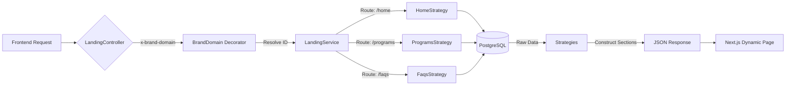

# Landing Module

The **Landing Module** serves as a **Headless CMS** backend for the frontend websites. It delivers dynamic, brand-scoped content structures (Hero sections, About text, Program lists) to allow the Next.js frontend to render pages without hardcoding content.

## 1. Architecture: Strategy Pattern

The module uses the **Strategy Pattern** to handle different page types. The `LandingService` delegates the data fetching logic to specific strategy classes based on the requested endpoint or slug.

*   **Interface**: `ILandingPageStrategy`
*   **Strategies**:
    *   `HomeStrategy`: Aggregates data for the homepage (Banner, Highlights, Stats, Testimonials).
    *   `AboutStrategy`: Returns vision, mission, and team structure.
    *   `ProgramsStrategy`: Lists programs or details for a specific program slug.
    *   `FaqsStrategy`: Returns FAQs with filtering and pagination.
    *   `SettingsStrategy`: Global site settings (Maintenance mode, Colors, Footer links).

## 2. Server-Driven UI

Instead of returning raw database rows, this module returns **UI-ready structures**. The response typically consists of a list of `sections`, each having a `type` and `content`.

**Example Response (Simplified):**

```json
{
  "slug": "home",
  "title": "Available Programs",
  "sections": [
    {
      "type": "hero_banner",
      "content": {
        "title": "Welcome to YBB",
        "bg_image": "https://..."
      }
    },
    {
      "type": "program_list",
      "content": {
        "items": [ ... ]
      }
    }
  ]
}
```

This allows the frontend to dynamically render components based on the `type` field (e.g., `<HeroBanner />`, `<ProgramList />`).

## 3. Brand Context Resolution

Like the Auth module, this module is **Multi-Tenant**. Every request resolves the `Brand` (Brand) context first.

Everything returned is scoped to that brand:
*   `Brand` (e.g., Istanbul Youth Summit)
    *   `Programs` (e.g., IYS 2024, IYS 2025)
    *   `Sponsors`
    *   `Testimonials`
    *   `FAQs`

**Resolution Priority:**
1.  **Header**: `x-brand-domain`
2.  **Query**: `url` (Fallback)

## 4. Key Endpoints

| Endpoint | Strategy | Description |
| :--- | :--- | :--- |
| `GET /landing/settings` | `SettingsStrategy` | Global site config (colors, logo, contacts). |
| `GET /landing/home` | `HomeStrategy` | The main landing page aggregation. |
| `GET /landing/about` | `AboutStrategy` | Static content about the organization. |
| `GET /landing/programs` | `ProgramsStrategy` | List of upcoming/past programs. |
| `GET /landing/programs/:slug` | `ProgramsStrategy` | Deep dive into a specific program. |
| `GET /landing/faqs` | `FaqsStrategy` | Searchable/Paginated FAQs. |

## 5. Flow Diagram


