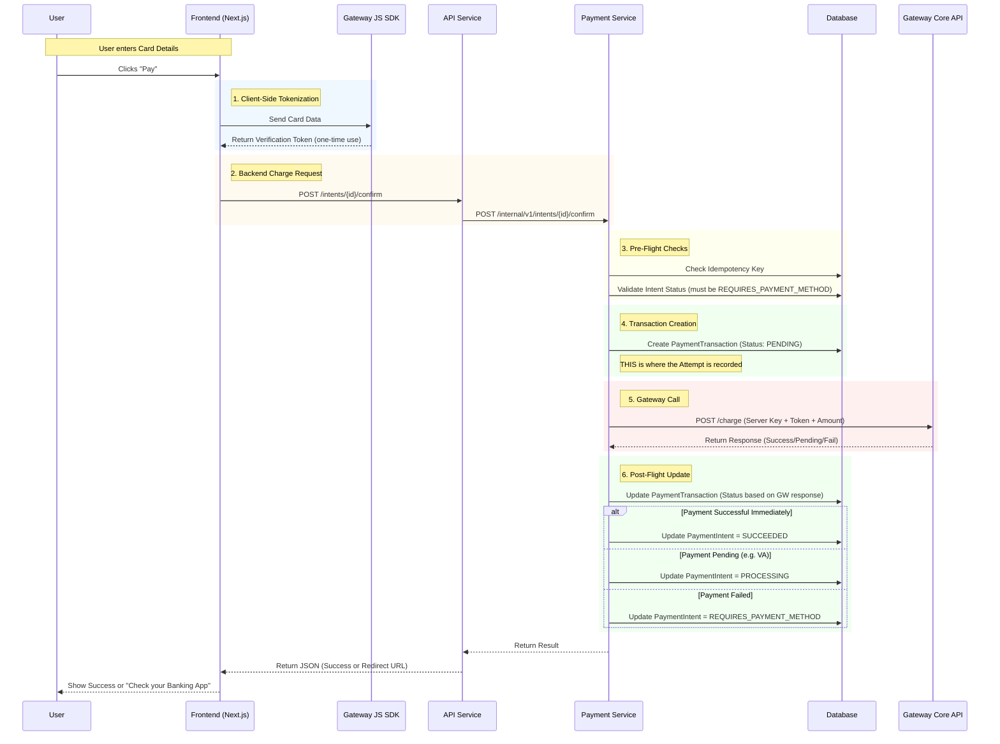
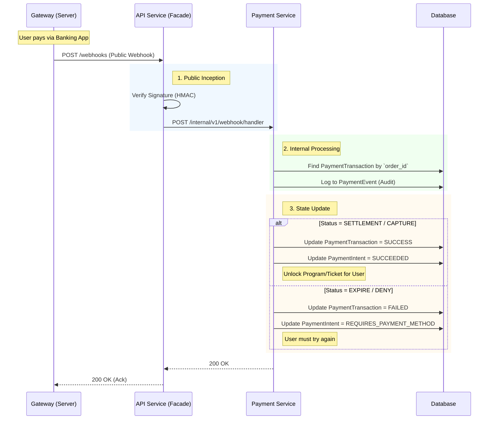
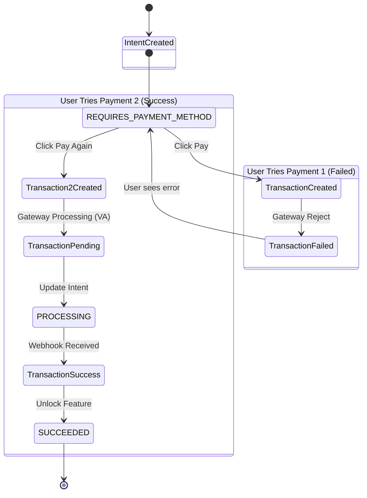

# Payment Gateway Journey & Sequence

This document details the exact sequence of operations when a user attempts a payment, specifically focusing on **when** the Payment Service calls the Gateway Provider (Midtrans/Xendit).

## 1. The "Click Pay" Journey (Synchronous)

This flow describes what happens immediately after the user enters their credit card details or selects a Virtual Account method and clicks "Pay".

### 1.1. Sequence Diagram

### 1.2. Key Moments

1.  **Tokenization (Client-Side)**: We **never** touch raw credit card numbers on our server. The Frontend talks directly to the Gateway first to get a safe `Token`.
2.  **The "Commit" Point (Step 4)**: Before calling the Gateway, we **must** create a `PaymentTransaction` record with status `PENDING`.
    *   *Why?* If the server crashes *during* the Gateway call, we need a record that we *tried* so we can check the status later (reconciliation).
3.  **The Gateway Call (Step 5)**: This is the single synchronous HTTP call to Midtrans/Xendit Core API.
    *   We send the `Token` we got from the Frontend.
    *   We send our `PaymentTransaction.id` as the `order_id` (so the Gateway knows our reference).

## 2. The Webhook Journey (Asynchronous)

For many methods (Virtual Accounts, E-Wallets, some Cards), the initial response is just "Pending". The actual success comes later via Webhook.

### 2.1. Sequence Diagram

## 3. Manual Payment Comparison

For Manual payments, the journey stops at Step 4 of the Synchronous flow.

1.  **User Clicks Pay**.
2.  **API Service** sees `PaymentMethod.type = MANUAL`.
3.  **Payment Service**:
    *   Creates `PaymentTransaction` (Status: `PENDING_REVIEW`).
    *   **Skips** Gateway Call.
    *   Returns generic instructions (`ManualPaymentDetail`) to Frontend.
4.  **User** transfers money offline.
5.  **User** uploads proof (New Flow: `POST /proof`).
6.  **Admin** reviews and manually triggers the "Webhook Journey" logic (Approve/Reject).

## 4. Error Analysis (The "Unhappy" Paths)

Developers must handle these scenarios gracefully.

| Scenario | Symptom | Action Needed |
| :--- | :--- | :--- |
| **User Cancelled** | User closes the Credit Card 3DS popup. | Gateway returns "Deny/Cancel". Mark Transaction `FAILED`. Show User "Payment Cancelled". |
| **Insufficient Funds** | Gateway returns 4xx error. | Mark Transaction `FAILED`. Show User "Card Declined". **DO NOT** Fail the Intent; let them try again. |
| **Network Timeout** | Our API times out waiting for Gateway. | Keep Transaction as `PENDING`. Background Job (Chronos) checks status later (Re-query Gateway API). |
| **Invalid Config** | Server Key is wrong/expired. | Log Error. Alert Devs. Return 500 to User. |

## 5. State Machine Transition Diagram

Visualizing how `PaymentIntent` and `PaymentTransaction` statuses interact.

## 6. FAQ for Developers

**Q: Where do I find the Server Key?**
A: It's in the `payment_gateway_configs` table. Do NOT hardcode it in `.env` if we support multiple programs.

**Q: Can a User have two `PENDING` transactions?**
A: Ideally no. If they try to pay again while one is Pending, we should probably cancel the old one or warn them. But technically the DB allows it.

**Q: How do I test Webhooks locally?**
A: Use **Ngrok**. Run `ngrok http 3000`, put the ngrok URL in the Midtrans Dashboard. Or use the internal `POST /test/webhook` endpoint if you built the mock.

**Q: What if the Admin rejects a Manual Payment?**
A: The Transaction becomes `REJECTED`. The Intent goes back to `REQUIRES_PAYMENT_METHOD`. The user gets an email saying "Please upload a clearer photo".
